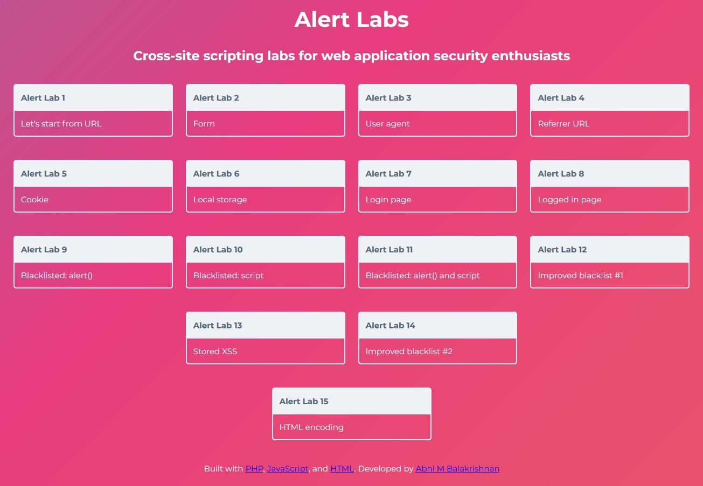

Alert Labs

Cross-site scripting labs for web application security enthusiasts

Getting started
1. Install [Docker Desktop](https://www.docker.com/products/docker-desktop).
2. Obtain the [Alert-Labs source code](https://github.com/Abhi-M/alert-labs/archive/master.zip).
3. Open Terminal and navigate to the alert-labs directory.
4. Issue the following command: docker-compose up -d
5. On your browser navigate to http://localhost:8090/

[Download](https://github.com/Abhi-M/alert-labs/archive/master.zip) | [Demo](https://exploitme.info/alert-labs/)

